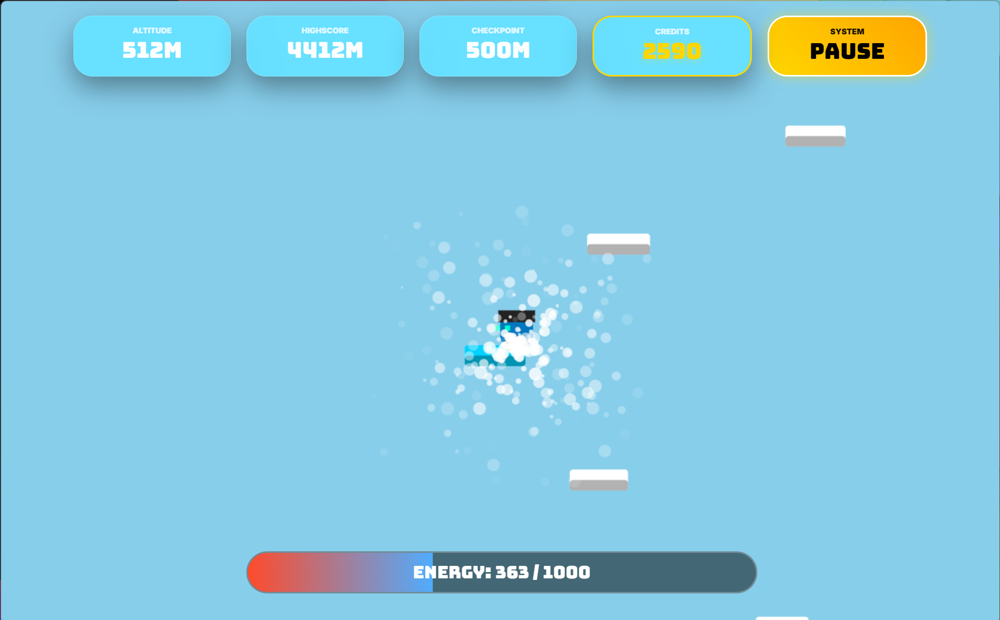
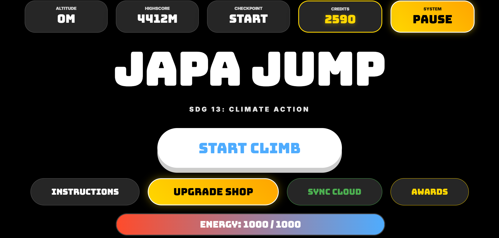

# 🚀 JAPA JUMP: DON'T LOOK DOWN
**Official SDG 13: Climate Action Edition**

> "Mission: Climate Action. Strategy: Don't Look Down."

A high-stakes, physics-based vertical climber where every meter—and every choice—counts. Navigate a procedurally generated world, manage your suit's life support, and survive the "Devil Zone" to secure the planet's future.

---

## 🎮 Pilot Controls

### ⌨️ Desktop (Optimized)
- **Move:** `WASD` or `Arrow Keys`
- **Jump:** `Space` or `W` (Triple-jump unlockable!)
- **Pause:** `ESC` for System Menu

### 📱 Mobile (Experimental)
- **Joystick:** Slide the **MOVE** button to steer.
- **Jump:** Tap the **JUMP** button.
*Best played in Landscape Mode.*

---

## ✨ Advanced Engineering

* **🚩 Zone-Crossing Checkpoints:** Never miss a save point again. Our custom "Zone Math" guarantees a **Blue Platform** and **Waving Flag** every 500m, ensuring your progress is locked into the telemetry network.
* **⚡ Energy Management:** Your suit's life support is finite. Every movement drains power. Use momentum and upgrades to conserve energy for the long climb.
* **🧩 System Failure Quizzes:** Energy hit 0%? Initiate a **Reboot Quiz**. Answer Climate Action questions correctly to restore 100% power and resume from your exact position.
* **🛠️ The Tech Shop:** Use earned Credits for permanent hardware upgrades:
    * **Ion Thrusters:** Boost jump height.
    * **Solar Panels:** Reduce passive drain.
    * **Void Plating:** Survive falls with emergency energy recovery.
* **🌐 Global Telemetry:** Full Cloud-Sync integration via Google Satellite Network. Your highscore, credits, and skins follow you on any device.

---

## 🔥 The Devil Zone (9,000m+)
At the 9,000-meter mark, the atmosphere thins and the sky turns crimson. Platforms shrink to their absolute minimum. Only the most elite pilots will reach the **Golden Platform at 10,000m** to complete the mission.

---

## 🛠️ Tech Stack
- **Engine:** Custom 2D HTML5 Canvas Engine
- **Audio:** Web Audio API Real-time Synthesizer
- **Backend:** Google Apps Script (GAS) Cloud Integration
- **UI:** Glassmorphism Design | Bungee & Inter Typography

**Developed by Jaap Thind**

---

  
  

